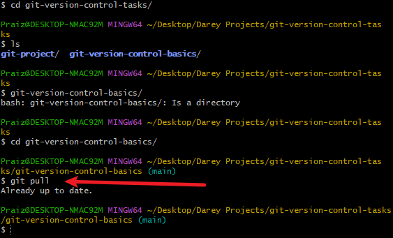

# git-version-control-basics
Version Control Basics For Git

## Hands-On: Version Control System and Why It Is Needed
A **Version Control System**(VCS) is a vitral tool in software development, designed to track and manage changes to code or documents over time. It eneables multiple developers to collaborate on the same project efficiently by controlling and merging changes made by different team members.

## Overwriting Work
If a member **"Tom"** makes changes to the home page file **"index.html"** to update the navigation and at the same time another team member **"Jerry"** makes changes to add contact information to the footer of the same home page thereby editing the same **"index.html"** file. Without VCS, the last person to upload their version of the file to the shared folder or server would overwrite the other person's changes, resulting in lost work.

## How VCS Solves These Problems
**Concurrent Development**: With a VCS , each team member can work on their sections simultaneously without fear of overwriting each others work. The VCS tracks all changes and manages differemt versions of the files, allowing changes to be merged eventually.

 We will be simulating an example using a VCS tool called Git

## Introducing Git: A Leading Version Control System
Git is a tool that helps people work together on computer projects like building a website. Think of it as a shared folder on your computer but much smarter. It keeps track of all the changes everyone makes, so if something goes wrong you can always go back to a version that worked. It also allows everyone work on their parts at the same time without getting on each other's way.
Git helps prevent mix-ups in project documentation.

## Conceptualising Git SetUp with Tom and Jerry.
1. Initial Setup
- Both Tom and Jerry have Git installed on their computers.

- They clone (or download) the repository from a central repository like GitHub, GitLab or Bitbucket to their local machines. This gives them each a complete copy of the project including all its files and version history.

2. Tom and Jerry start working:
- Tom and Jerry pull the latest changes from the central repository to ensure they start with the most current file of **index.html** file.

- They both create a new branchfrom the main project. A branch in Git allows developers to work on a copy of the codebase without affecting the main line of development. Tom name's his branch **update-navigation** and Jerry names his **add-contact-info**

Tom's branch

Jerry's branch

3. Making Changes:
- On his branch, Tom updates the navigation bar in **index.html**
- Simultaneously, Jerry works on his branch to add contact information to the footer of the same file.
- They commit their changes to their respective branches. A commit in git is like saving your work with a note about what you have done.

4. Merging Changes:
- Once they,re done, Tom and Jerry push their branches to the central repository.
- Tom decided to merge his changes first. He creates a **pull request(PR)** for his branch **update-navigation**. A Pr is a way to tell the group that he's done and his code is ready to be reviewed and merged into the main project.
- After reviewing Tom's changes, the team merges his PR into the main branch, updating the **index.html** file on the main project line.
- Jerry then updates his branch with the latest changes from the main project to include Tom's updates. This step is crucial to ensure that Jerry is working with integrating his changes into the most current version of the project.
- Jerry resolves and conflicts that arise from Tom's changes and his own. Git provides tools and commands to helps identify and resolve these conflicts.
- Jerry then pushes his updated branch and creates a PR for his changes. The team reviews Jerry's additions, and once they're approved, his changes are merged into the main project.

## CONCLUSION 
Through this process, Tom and Jerry were able to work on the same file simultaneously without overwriting each other's work. Git tracked their changes, allowing them to merge the updates seamlessly into the main project. This example illustrates the power of using a VCS like Git for collaborative development, ensuring that all contributions are preserved and integrated effectively and efficiently.

+